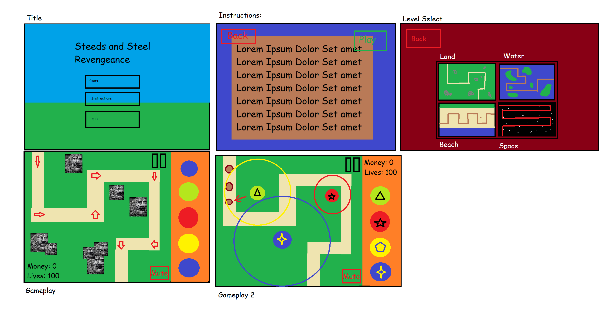

# Steeds and Steel II: Revengeance

# Our Rough Design Diagram

# Note
All contents within node_modules have been taken out because extracting those takes forever and other teachers have said it's better not to include them, `npm i` will install them again.

# Who did what

Eddie
- 
- Developed the Tower and Bullet Class (DemoandTower.zip)

Lisset:
- 
- Developed our multiscene base that everything will be built on (MultipleScenes.zip)

Alex:
- 
- Developed the wave spawning and path following system (WaveSpawner.zip)
- Merged everyone's work (AllPutTogether.zip)

Brendan:
- 
- Started on our first map (map.pdf) and some other assets (GroupExport.pdf)

